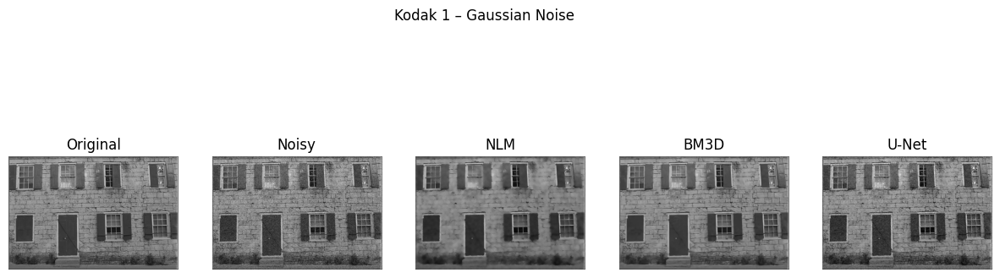

# Image Denoising using Statistical Filters and Deep Neural Networks

Implementation and evaluation of classical and deep learning-based image denoising methods. The project compares Non-Local Means (NLM), BM3D, and U-Net under different noise models (Gaussian, Salt & Pepper), using PSNR as the primary performance metric.

---

## Abstract

This project presents a comparative experimental study between classical statistical denoising algorithms and deep learning-based architectures for image restoration.

Three approaches were implemented and evaluated:

- Non-Local Means (NLM)
- BM3D
- U-Net Denoising Autoencoder

The evaluation was conducted on benchmark datasets (CBSD68 and Kodak24) under Gaussian and Salt & Pepper noise models. Performance was measured using Peak Signal-to-Noise Ratio (PSNR).

The experimental findings demonstrate that performance superiority is strongly dependent on noise distribution assumptions and model inductive bias.

---

## Dataset

- **Training Dataset:** CBSD68  
- **Evaluation Dataset:** Kodak24 (24 high-quality color images)  
- Resolution: 768×512 / 512×768  

---

## Evaluation Metric

### Peak Signal-to-Noise Ratio (PSNR)

```
PSNR = 10 × log10(MAX² / MSE)
```

Where `MAX = 255` for 8-bit images.

Higher PSNR values indicate better reconstruction quality.

Interpretation:
- PSNR > 30 dB → Very high quality
- 20–30 dB → Acceptable quality
- < 20 dB → Low quality

---

## Experimental Setup

- Gaussian Noise: μ = 0, varying σ
- Salt & Pepper Noise: 5–15% corruption
- U-Net training:
  - Optimizer: Adam
  - Learning rate: 0.001
  - Epochs: 50–100
  - Loss: MSE
  - Batch size: 16

---

## Pipeline Overview

1. Noise injection (Gaussian / Salt & Pepper)
2. Denoising via:
   - NLM
   - BM3D
   - U-Net
3. PSNR computation
4. Aggregated benchmarking on Kodak24
5. Comparative analysis

The pipeline enables controlled experimentation, modular implementation, and reproducible benchmarking across noise configurations.

---

# Quantitative Results

## Gaussian Noise (Kodak24 Average PSNR)

| Method | PSNR (dB) | Improvement |
|--------|-----------|-------------|
| Noisy Image | 20.22 | - |
| NLM | 27.62 | +7.40 dB |
| BM3D | **29.94** | **+9.72 dB** |
| U-Net | 26.70 | +6.48 dB |

**Observation**

- **BM3D achieved the highest PSNR (29.94 dB)**
- Classical collaborative filtering remains superior for Gaussian noise
- U-Net underperformed compared to BM3D in this configuration

---

## Salt & Pepper Noise (Kodak24 Average PSNR)

| Method | PSNR (dB) | Improvement |
|--------|-----------|-------------|
| Noisy Image | 18.25 | - |
| NLM | 18.30 | +0.05 dB |
| BM3D | 23.65 | +5.40 dB |
| U-Net | **23.83** | **+5.58 dB** |

**Observation**

- **U-Net achieved the best performance (23.83 dB)**
- Deep learning methods proved more robust to impulse noise
- NLM failed to handle Salt & Pepper noise effectively

---

# Visual Results

## Gaussian Noise – Kodak 1 Example



BM3D preserves structural details and edges more effectively under Gaussian noise, while U-Net provides competitive smoothing but slightly lower PSNR.

---

## Salt & Pepper Noise – Kodak 1 Example


U-Net demonstrates superior robustness to impulse noise, removing sparse corruption while maintaining structural consistency.

---

## PSNR Comparison Plot


The bar plot summarizes the quantitative benchmarking across noise types.

---

## Comparative Ranking

| Method | Gaussian Rank | Salt & Pepper Rank |
|--------|--------------|-------------------|
| BM3D | 🥇 1st | 2nd |
| U-Net | 3rd | 🥇 1st |
| NLM | 2nd | 3rd |

---

## Key Findings

- BM3D outperforms deep learning models under Gaussian noise (+3.24 dB over U-Net).
- U-Net generalizes better across different noise distributions.
- NLM performs adequately only under Gaussian noise.
- Model superiority strongly depends on noise distribution assumptions.
- Classical methods exploit strong inductive priors, while neural networks provide flexibility.

---

## Engineering Perspective

This project was designed and evaluated as an end-to-end denoising pipeline, focusing on:

- Reproducible experimentation
- Modular architecture
- Quantitative benchmarking
- Hyperparameter tuning
- Performance-driven comparison

The objective was structured evaluation under controlled experimental conditions rather than isolated model testing.

---

## Scalability Considerations

- Classical methods require prior noise estimation.
- U-Net provides faster inference after training.
- GPU acceleration significantly reduces training time.
- The architecture can be extended to real-time or video denoising applications.
- Neural models can be exported (e.g., ONNX) for optimized deployment.

---

## Limitations

- Limited training data for U-Net
- Evaluation based solely on PSNR (no SSIM or perceptual metrics)
- Fixed noise levels
- No real-world noisy image evaluation

---

## Future Engineering Extensions

- Add SSIM and perceptual metrics
- Deploy via REST API (FastAPI)
- Convert trained model to ONNX
- Implement blind/mixed-noise denoising
- Extend to video denoising

---

## Project Structure

```
image-denoising-benchmark/
│
├── notebooks/
│   └── DENOISING_PROJECT.ipynb
│
├── report/
│   └── Image_Denoising_Report.pdf
│
├── slides/
│   └── Presentation.pptx
│
├── results/
│   ├── kodak1_gaussian_comparison.png
│   ├── kodak1_saltpepper_comparison.png
│   └── psnr_plot.png
│
├── requirements.txt
└── README.md
```

---

## Installation

```bash
git clone https://github.com/KonstantinosBountou/image-denoising-benchmark.git
cd image-denoising-benchmark
pip install -r requirements.txt
```

---

## How to Run

```bash
jupyter notebook notebooks/DENOISING_PROJECT.ipynb
```

---

## License

MIT License
